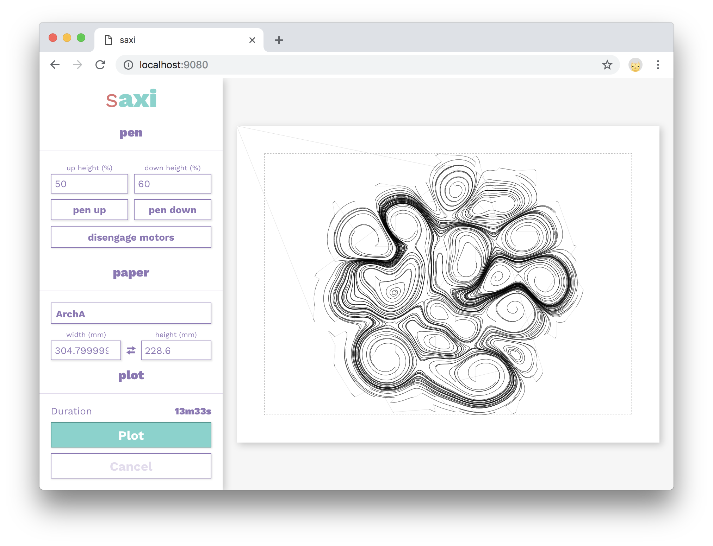

# saxi
##### make plot good

saxi is a tool for interacting with the [AxiDraw
drawing machine](https://axidraw.com/) by Evil Mad Scientist. It comes with an
easy-to-use interface, and is exactingly precise.

- automatically scales & centers your drawing to fit on the paper
- minimizes pen-up travel time by reordering & reversing paths
- uses a custom motion planning algorithm (inspired by [axi](https://github.com/fogleman/axi)) that's smooth & fast
- automatically splits apart layers based on SVG stroke colors or group IDs
- has a web-based UI, so there's no need to muck around with installing X11 and Inkscape
- can run on a Raspberry Pi or similar, so you don't need to be tethered to your plotter while it plots



### Usage

```
$ npm i -g saxi
$ saxi
Server listening on http://0.0.0.0:9080
Connecting to EBB on /dev/tty.usbmodem1461
```
If you encounter an `EACCES` error when installing the package globally, see [Resolving EACCES permissions errors when installing packages globally](https://docs.npmjs.com/resolving-eacces-permissions-errors-when-installing-packages-globally).

#### Raspberry Pi
To install saxi on a Raspberry Pi, first install node.js if you haven't already:

```
$ curl -sL https://deb.nodesource.com/setup_12.x | sudo -E bash -
$ sudo apt-get install -y nodejs
```

and then proceed as above :) If you connect to the raspberry pi over ssh, you might want to run the `saxi` server inside a tmux or screen session to have it stay running even if your ssh session disconnects.

#### CORS
If you want to connect to saxi from a web page that isn't served by saxi
itself, you'll need to enable
[CORS](https://developer.mozilla.org/en-US/docs/Web/HTTP/CORS), otherwise
GET/POST requests will be denied by the browser. CORS is disabled by default as
a security precaution, but if you need it it's available. Just launch saxi with
the `--enable-cors` flag.

### Info

saxi makes use of the low-level `LM` command introduced in EBB firmware version
2.5.3 to carry out highly accurate constant-acceleration motion plans. If your
AxiDraw is running an older version of the firmware, saxi will fall back to the
less-accurate (but still pretty accurate) `XM` command.

To check what version of the EBB firmware your AxiDraw is running, run `saxi --firmware-version`:

```
$ saxi --firmware-version
EBBv13_and_above EB Firmware Version 2.5.3
```

To upgrade your AxiDraw's firmware, see [here](https://github.com/evil-mad/EggBot/tree/master/EBB_firmware).

### Developing

To work on saxi, you can clone this repo and then run `npm start`:

```sh
$ git clone https://github.com/nornagon/saxi
$ cd saxi
$ npm run dev
```

This will watch local files for changes. If you change the server code, you'll need to restart manually.

### Credits
saxi's motion planning algorithm is heavily inspired by Michael Fogleman's
[axi](https://github.com/fogleman/axi) project.

saxi's UI would be an ugly mess if it weren't for [@kylestetz](https://github.com/kylestetz)'s discerning eye.

Thanks to [Evil Mad Scientist](http://www.evilmadscientist.com/) for designing
and building such a lovely machine!

---

## Made with saxi

These images were plotted by folks using saxi. If you'd like to add something you've made here, [shoot me an email](mailto:nornagon@nornagon.net)!

<table>
  <tbody>
    <tr>
      <td width=300>
        <a href="https://www.instagram.com/p/B9hFx9KFOwG/"></a>
        <p>by <strong>Julien Terraz (<a href="https://www.instagram.com/targz/">@targz</a>)</strong></p>
      </td>
      <td width=300>
        <a href="https://github.com/abey79/vpype-explorations"></a>
        <p>by <strong>Antoine Beyeler (<a href="https://twitter.com/abey79">@abey79</a>)</strong></p>
      </td>
      <td width=300>
        <a href="https://twitter.com/MAKIO135/status/1253334618243125256"></a>
        <p>by <strong>Lionel Radisson (<a href="https://twitter.com/MAKIO135">@MAKIO135</a>)</strong></p>
      </td>
    </tr>
    <tr>
      <td width=300>
        <a href="https://www.instagram.com/p/B4iixy7gDB9/"></a>
        <p>by <strong>Daniel Feles (<a href="https://www.instagram.com/daniel_feles/">@daniel_feles</a>)</strong></p>
      </td>
      <td width=300>
      </td>
      <td width=300>
      </td>
    </tr>
  </tbody>
</table>
